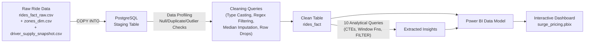

# 🚕 RideMetriq | Ride-Hailing Surge Pricing Analytics
### *An End-to-End Data Analytics Project — SQL • Power BI*


> A complete surge pricing analytics pipeline — from messy raw ride-hailing data to an interactive Power BI dashboard, uncovering **when and where surge pricing maximizes revenue, where it drives riders away, and what the optimal surge caps should be across zone types and cities.**

---

## 📌 Table of Contents
- [Problem Statement](#-problem-statement)
- [Power BI Dashboard Preview](#-power-bi-dashboard-preview)
- [Project Architecture](#-project-architecture)
- [Tech Stack](#-tech-stack)
- [Dataset](#-dataset)
- [Project Workflow](#-project-workflow)
- [Key Business Insights](#-key-business-insights)
- [Repository Structure](#-repository-structure)
- [How to Reproduce This Project](#-how-to-reproduce-this-project)
- [Results & Recommendations](#-results--recommendations)

---

## 🎯 Problem Statement

A ride-hailing platform operating across **6 Indian cities** needs to evaluate its dynamic (surge) pricing strategy. Leadership needs answers to:

1. **Where does surge pricing generate meaningful revenue, and where does it just drive riders to cancel?**
2. **How does demand-supply pressure vary by zone type, time of day, and day type — and does driver supply actually respond to surge signals?**
3. **What should the optimal surge cap be for each zone type to maximize the revenue-to-cancellation tradeoff?**

This project provides an end-to-end analytical solution: cleaning raw, messy ride event data entirely in **SQL (PostgreSQL)**, and visualizing surge dynamics, revenue impact, and zone-level recommendations via an interactive **Power BI** dashboard.

---

## 📊 Power BI Dashboard Preview

*(3-page interactive dashboard — Surge Overview • Revenue Impact • Recommendations)*

### [Page 1 — Surge Overview]


### [Page 2 — Revenue Impact]


### [Page 3 — Recommendation]


---

## 🏗 Project Architecture



**The flow in plain English:**
`Raw CSVs → PostgreSQL Staging → SQL Cleaning & Imputation → Clean Fact Table → SQL Analysis Queries → Power BI Model → 3-Page Interactive Dashboard`

---

## 🛠 Tech Stack

| Layer | Tool | Purpose |
|---|---|---|
| **Data Cleaning** | SQL (PostgreSQL) | Profiling, regex-based type casting, duplicate removal, outlier filtering, median imputation |
| **Data Analysis** | SQL (PostgreSQL) | Surge pattern analysis, cancellation funnels, revenue counterfactuals, supply-demand correlation |
| **BI & Visualization** | Power BI Desktop | Star-schema data model, DAX measures, 3-page interactive dashboard with slicers |

---

## 🗂 Dataset

The dataset follows a **star-schema** design with **3 source files** spanning 6 Indian cities (Bangalore, Mumbai, Delhi NCR, Hyderabad, Chennai, Pune).

| File | Rows | Role | Description |
|---|---|---|---|
| `rides_fact_raw.csv` | 43,296 | Fact Table | Individual ride events — timestamps, fares, surge multipliers, ride status, cancellation reasons |
| `zones_dim.csv` | 33 | Dimension | Zone metadata — zone name, city, zone type (Airport / Nightlife / Business / Tech Park / Residential) |
| `driver_supply_snapshot.csv` | 35,640 | Supporting | Hourly driver availability snapshots — drivers online, on trip, idle per zone |

**Key attribute groups:**
- 🚗 **Ride Details:** ride_id, vehicle_type (Bike / Auto / Mini / Sedan), distance_km, duration_min, ride_status
- 💰 **Pricing & Surge:** base_fare, final_fare, surge_multiplier, dsr (demand-supply ratio)
- 📍 **Zone & Geography:** zone_id, zone_name, zone_type, city
- 🌧 **Context:** weather_flag (Clear / Rain), event_flag (None / Event), hour of day, day type
- 👤 **Rider & Driver:** rider_id, driver_id, cancel_reason, payment_mode

**Data Quality Issues (Intentionally Realistic):**
| Issue | Affected Column(s) | Volume |
|---|---|---|
| Missing values | distance_km, driver_eta_min, weather_flag, payment_mode, vehicle_type | ~0.8–2.5% each |
| Exact duplicate rows | all columns | ~1.2% |
| Outliers | distance_km (400–900 km), final_fare (₹35k–90k) | ~0.3% each |
| Negative / zero values | driver_eta_min, distance_km | ~0.2% each |
| Mixed data types | surge_multiplier ("High", "1.5x surge"), final_fare ("Rs.245.0"), drivers_online_zone ("unavailable") | ~0.3–1% each |
| Malformed dates | request_timestamp ("N/A", "31-13-2026 25:99") | ~0.4% |

---

## 🔄 Project Workflow

### 1️⃣ Data Profiling & Cleaning — *SQL (PostgreSQL)*

All data cleaning was performed **entirely in SQL** — no Python was used — to demonstrate SQL proficiency in a realistic data engineering scenario.

- **Staging:** Loaded all 3 CSVs into PostgreSQL, keeping the raw rides table as all-TEXT columns to safely ingest dirty data.
- **Profiling:** Ran null counts, duplicate checks, distinct value scans, and min/max outlier analysis on every column.
- **Cleaning Pipeline:**
  - Removed exact duplicate rides using `DISTINCT ON (ride_id)`
  - Cast columns to correct types using **regex validation** (`~ '^\\d+(\\.\\d+)?$'`) — invalid values (e.g., "High", "Rs.245.0", "unavailable") were safely nullified instead of crashing the pipeline.
  - Filtered outliers: `distance_km` capped at 0.1–60 km, `final_fare` at ₹10–₹3,000, negative `driver_eta_min` removed.
  - **Median imputation** for `distance_km` and `driver_eta_min` (grouped by `zone_type`) to preserve distribution shape.
  - **Dropped rows** where core analytical metrics (`final_fare`, `surge_multiplier`, `request_timestamp`) were null — these are non-imputable.
- **Result:** ~42,000 clean rows in `rides_fact`, ready for analysis.

### 2️⃣ Advanced Analysis — *SQL*
Developed **10 analytical queries** using `FILTER`, `CASE`-based banding, CTEs, JOINs, and aggregations to extract insights across three themes:

| Theme | Queries | Key Technique |
|---|---|---|
| **Surge Patterns** | Avg surge by zone type, surge heatmap by hour × zone, weekday vs weekend DSR, city comparison | `EXTRACT(HOUR)`, `EXTRACT(DOW)`, conditional aggregations |
| **Revenue & Rider Impact** | Cancellation rate by surge band, revenue lift vs flat-fare counterfactual, repeat-cancellation churn cohort, cancellation reason breakdown | `FILTER(WHERE ...)`, surge banding with `CASE`, counterfactual `SUM(final_fare / surge_multiplier)` |
| **Supply & Recommendations** | Driver supply response to surge, recommended surge caps by zone type | `JOIN` with `driver_supply_snapshot`, `DATE_TRUNC` alignment |

### 3️⃣ Data Modeling & Visualization — *Power BI*
- Built a **3-page interactive dashboard** connecting cleaned data to business metrics with a custom amber/brown theme.
- **Page 1 — Surge Overview:** Headline KPIs (avg surge 1.36x, 76.98% rides surged, ₹1.51M total surge revenue, avg DSR 1.43), surge intensity heatmap by zone × hour, DSR trend by day type, zone and city comparisons.
- **Page 2 — Revenue Impact:** Supply elasticity score (0.17), driver supply vs demand hourly trend, revenue index vs cancellation index by surge band, avg rider wait time (8.27 min).
- **Page 3 — Recommendation:** Current surge vs recommended cap by zone type (bar chart), key findings text with actionable zone-specific cap recommendations.
- Authored DAX measures for computed KPIs and used slicers for zone type, city, and time-based filtering.

---

## 🔍 Key Business Insights

> *(Derived directly from the analytical pipeline — these findings power the business recommendations)*

- 🌃 **Nightlife & Airport zones surge hardest** (1.44x / 1.41x avg) driven by fundamentally different demand patterns — Airport spikes around flight timings (4–6am, 8–10pm), while Nightlife spikes late at night (8pm–11pm). Business and Tech Park follow a predictable office-commute double-peak.
- 📈 **Revenue gains flatten past 1.5–1.8x surge** — revenue share peaks at the 1.5–1.8x band (45.6%), but pushing surge further only adds cancellations, not revenue. The revenue-to-cancellation tradeoff turns negative above 1.8x.
- 🚫 **Surge is the #1 cancellation driver** — riders who cancelled twice or more due to `High_Surge_Fare` form a quantifiable churn-risk cohort, signaling the price ceiling beyond which pricing becomes self-defeating.
- 🔄 **Driver supply barely responds to surge** — supply elasticity score of just **0.17** means a 10% increase in surge only brings ~1.7% more drivers online. The incentive signal isn't strong enough to rebalance supply, making aggressive surge pricing ineffective as a supply lever.
- 🌧 **Rain pushes average surge up by ~0.2x** and Event days by ~0.3x — contextual triggers that are predictable and should be pre-hedged with scheduled driver incentives.
- 🏙 **Surge is driven by zone type and time, not city** — the pattern holds consistently across all six cities (Bangalore 1.41x → Chennai 1.32x), confirming that zone-level caps are the right policy lever, not city-level ones.

---

## 📁 Repository Structure

```text
surge_pricing_project/
│
├── README.md                              # You are here
├── data_dictionary.md                     # Column definitions & data quality notes
│
├── Raw Data/                              # Source CSVs (star-schema)
│   ├── rides_fact_raw.csv                 # 43,296 ride events (messy, needs cleaning)
│   ├── zones_dim.csv                      # 33 zone definitions across 6 cities
│   └── driver_supply_snapshot.csv         # 35,640 hourly driver availability records
│
├── surge_pricing_Postgre.sql              # Full SQL pipeline (schema + cleaning + 10 analysis queries)
├── surge_pricing.pbix                     # Power BI dashboard (3 pages)
│
└── dashboard-screenshots/                 # Exported dashboard screenshots
    ├── surge_overview_page01.png
    ├── revenue_impact_page02.png
    └── recommendation_page03.png
```

---

## ⚙️ How to Reproduce This Project

1. **Database Setup (PostgreSQL):**
   - Create a new database and run the `CREATE TABLE` statements from `surge_pricing_Postgre.sql`.
   - Import the 3 CSVs from the `Raw Data/` folder using `\COPY` or pgAdmin's import tool.
2. **Data Cleaning & Analysis:**
   - Execute the cleaning queries (Steps 5–7) in `surge_pricing_Postgre.sql` to build the clean `rides_fact` table.
   - Run the analysis queries (Step 8a–8k) to reproduce all insights.
3. **Power BI Dashboard:**
   - Open `surge_pricing.pbix` in Power BI Desktop.
   - Update the Data Source settings to point to your PostgreSQL instance (or import the cleaned data as CSV).
   - Refresh the model to interact with the 3-page dashboard.

---

## ✅ Results & Recommendations

| Finding | Recommended Action |
|---|---|
| **Revenue flattens past 1.5–1.8x surge** | Cap surge at **1.5x for Residential**, **1.6x for Business** — these zones have the weakest revenue-to-cancellation ratio above these thresholds. |
| **Nightlife/Airport can tolerate higher surge** | Allow surge up to **2.0–2.2x** for Nightlife and Airport zones — strong revenue lift (40%+) with manageable cancellation cost due to inelastic demand. |
| **Tech Park balances both** | Set Tech Park cap at **1.8x** — sits in between, balancing revenue lift and rider retention. |
| **Supply elasticity is near-zero (0.17)** | Surge alone won't fix supply shortages. Deploy **scheduled driver bonuses** during predicted high-demand windows (flight times, nightlife hours, rain forecasts) instead of relying purely on surge. |
| **Repeat surge-cancellation cohort** | Implement **loyalty-based surge shields** (e.g., cap surge at 1.3x for riders with 50+ lifetime rides) to retain high-value riders who are being priced out. |
| **Rain & Events are predictable triggers** | Use weather APIs and event calendars to **pre-position drivers** 30–60 min before predicted demand spikes, reducing the need for reactive surge entirely. |
